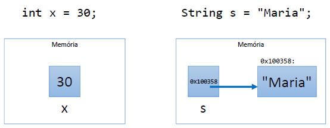
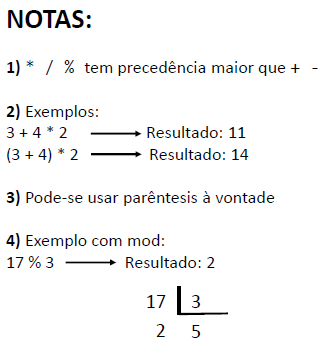
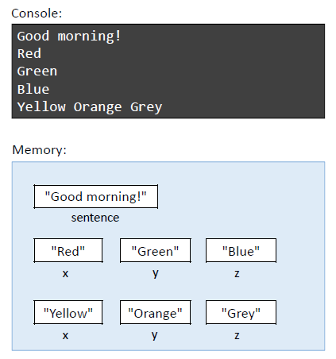
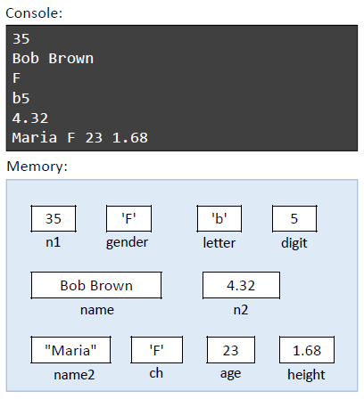

# Java COMPLETO 2018 Programação Orientada a Objetos +Projetos

*Reiniciado 2019*

https://www.udemy.com/java-curso-completo/

Curso mais didático e completo de Java e Orientação a Objetos. Projetos reais com UML, Spring Boot, MongoDB e muito mais 

## <a name="indice">Índice</a>

1. [Introdução](#parte1)     
2. [Apresentação da linguagem Java e tópicos básicos](#parte2)     
3. [Introdução à Programação Orientada a Objetos](#parte3)     
4. [Construtores, palavra this, sobrecarga, encapsulamento](#parte4)     
5. [Comportamento de memória, arrays, listas](#parte5)     
6. [Tópicos especiais em Java](#parte6)     
7. [Bônus - nivelamento sobre Git e Github](#parte7)     
8. [Enumerações, composição](#parte8)     
9. [Herança e polimorfismo](#parte9)     
10. [Tratamento de exceções](#parte10)     
11. [Projeto: Sistema jogo de xadrez](#parte11)     
12. [Trabalhando com arquivos](#parte12)     
13. [Interfaces](#parte13)     
14. [Generics, Set, Map](#parte14)     
15. [Programação funcional e expressões lambda](#parte15)     
16. [Acesso a banco de dados com JDBC](#parte16)     
17. [Interface gráfica com JavaFX](#parte17)     
18. [Projeto: Aplicação desktop com JavaFX e banco de dados MySQL com JDBC](#parte18)     
19. [Projeto: API Restful web com Spring Boot e banco de dados MongoDB](#parte19)     
20. [Seção bônus](#parte20)     
---


## <a name="parte1">1 - Introdução</a>


[Voltar ao Índice](#indice)

---


## <a name="parte2">2 - Apresentação da linguagem Java e tópicos básicos</a>

#### 2.4. Contextualização Parte 1 histórico e edições

- Linguagem de programação (regras sintáticas)
- Plataforma de desenvolvimento e execução
  - Bibliotecas (API)
  - Ambientes de execução

**Aspectos notáveis**

- Código compilado para bytecode e executado em máquina virtual (JVM)
- Portável, segura, robusta
- Roda em vários tipos de dispositivos
- Domina o mercado corporativo desde o fim do século 20
- Padrão Android por muitos anos

**Edições**

- Java ME - Java Micro Edition - dispositivos embarcados e móveis - IoT
  - http://www.oracle.com/technetwork/java/javame
- Java SE - Java Standard Edition - core - desktop e servidores
  - http://www.oracle.com/technetwork/java/javase
  - https://en.wikipedia.org/wiki/Java_version_history
- JavaFX - desktop e RIA
- Java EE - Java Enterprise Edition - aplicações corporativas
  - http://www.oracle.com/technetwork/java/javaee
  - https://en.wikipedia.org/wiki/Java_EE_version_history


#### 2.5. Contextualização Parte 2 JRE, JDK, bytecodes e máquina virtual

- Bibliotecas - API specification
  - https://docs.oracle.com/javase/8/docs/api/
  - https://docs.oracle.com/javase/10/docs/api/
- JVM - Java Virtual Machine
  - Máquina virtual do Java - necessário para executar sistemas Java
- http://www.oracle.com/technetwork/java/javase/downloads
  - JRE - Java Runtime Environment
  - Necessário para usuários finais executarem aplicações Java no computador
- Server JRE
  - Necessário para executar sistemas Java em servidores
- JDK - Java Development Kit
  - Necessário para desenvolvedores Java. Contém o JRE, mais ferramentas para desenvolvimento, depuração e monitoramento de projetos Java.

**Compilação e interpretação**

- Linguagens compiladas: C, C++
- Linguagens interpretadas: PHP, JavaScript
- Linguagens pré-compiladas + máquina virtual: Java, C#

**Modelo de execução**


#### 2.6. Estrutura de uma aplicação Java

- Uma aplicação é composta por classes
- package = agrupamento LÓGICO de classes relacionadas
- Módulo (Java 9+) = Agrupamento lógico de pacotes relacionados
  - Runtime = Agrupamento físico
- Aplicação = Agrupamento de módulo relacionados

#### 2.8. Instalação do JDK e Eclipse no Windows

**Checklist**

- Certifique-se de que seu Windows esteja devidamente licenciado e atualizado
  - Windows update

- Baixar e instalar o Java JDK
  - http://www.oracle.com/technetwork/java/javase/downloads

- Configurar variáveis de ambiente do sistema
  - Painel de Controle -> Variáveis de Ambiente
  - Variável JAVA_HOME: C:\Program Files\Java\jdk-10.0.1
  - Variável Path: incluir C:\Program Files\Java\jdk-10.0.1\bin
  - Testar no terminal de comando: java --version

- Baixar e descompactar o Eclipse
  - https://www.eclipse.org/downloads/eclipse-packages/
  - Testar: rodar o Eclipse e escolher um "workspace" (pasta onde você vai salvar seus projetos)

#### 2.9. Primeiro programa em Java no Eclipse

**Checklist**

- Window -> Perspective -> Open Perspective -> Java
- File -> New -> Java Project
- Package Explorer
  - JRE System Library
  - Pasta "src"
- Criar classe
  - Botão direito no projeto -> New -> Class
  - Escolher um nome para a classe (iniciar com letra Maiúscula)
  - Escolher um nome para o pacote (iniciar com letra Minúscula)
  - Selecionar public static void main
- Classe
  - package
  - Cláusula import: referências a outros pacotes
  - Classe
  - Método
  - public static void main(String[] args)
- Executar o programa: Botão direito no arquivo -> Run As -> Java Application
- Como fechar e reabrir o projeto? E o workspace?
- Dica: indentação automática: CTRL + SHIFT -> F

- 2-Apresentacao-da-linguagem-Java-e-topicos-basicos\Course_1\src\course\Program.java

```java
package course;

public class Program {
	public static void main(String[] args) {
		System.out.println("Hello world!");
	}
}

```

#### 2.10. Tipos primitivos em Java

**Checklist**

- https://docs.oracle.com/javase/tutorial/java/nutsandbolts/datatypes.html

- Java é uma linguagem estaticamente tipada
- Tipos primitivos em Java
- Tipos referência String e Object
- Variável não iniciada
- Valores padrão
- Overflow
- Padrão para float: sufixo "f"
- Padrão para char: aspas simples
- Padrão para string: aspas duplas
- Padrão para boolean: true, false
- Opção: inferência de tipos com palavra "var" (dentro de métodos)

**Tipos primitivos em Java (tipo valor)**


**String e Object**


**Valores padrão**

Quando criamos um array ou um objeto com atributos desses tipos, esses são os valores atribuídos inicialmente aos dados.


**Tipo valor vs. tipo referência**



```java
package app;

public class Programm {

	public static void main(String[] args) {

		boolean completed = false;
		char gender = 'F';
		char letter = '\u0041';
		byte n1 = 126;
		int n2 = 1000;
		int n3 = 2147483647;
		long n4 = 2147483648L;
		float n5 = 4.5f;
		double n6 = 4.5;
		
		String name = "Maria Green";
		Object obj1 = "Alex Brown";
		Object obj2 = 4.5f;
		
		System.out.println(completed);
		System.out.println(gender);
		System.out.println(letter);
		System.out.println(n1);
		System.out.println(n2);
		System.out.println(n3);
		System.out.println(n4);
		System.out.println(n5);
		System.out.println(n6);
		System.out.println(name);
		System.out.println(obj1);
		System.out.println(obj2);

	}

}

```

#### 2.11. Restrições e convenções para nomes

- Não pode começar com dígito: use uma letra ou _
- Não usar acentos ou til
- Não pode ter espaço em branco
- Sugestão: use nomes que tenham um significado

**Convenções**

- Camel Case: lastName
  - pacotes
  - atributos
  - métodos
  - variáveis e parâmetros
- Pascal Case: ProductService
  - classes

```java
package entities;
public class Account {
    private String holder;
    private Double balance;
    public Account(String holder, Double balance) {
        this.holder = holder;
        this.balance = balance;
    }
    public String getHolder() {
        return holder;
    }
    public void deposit(double amount) {
        balance += amount;
    }
    public void withdraw(double amount) {
        balance -= amount;
    }
}
```

#### 2.12. Conversão implícita e casting

- Conversão implícita entre tipos
- Casting: conversão explícita entre tipos COMPATÍVEIS

```java
package app;

public class Programm {

	public static void main(String[] args) {
		
		// Exemplo 1
		/*
		double a;
		float b;
		a = 5.0;
		b = (float)a;
		System.out.println(b);
		*/
		
		// Exemplo 2
		/*
		double a;
		int b;
		a = 5.0;
		b = (int)a;
		System.out.println(b);
		 */

		//Exemplo 3
		int a, b;
		double result;
		a = 5;
		b = 2;
		result = (double) a / b;
		System.out.println(result);

	}

}

```

#### 2.13. Saída de dados em Java

```java
package app;

import java.util.Locale;

public class Programm {

	public static void main(String[] args) {
		
		char gender = 'F';
		int age = 32;
		double balance = 10.35784;
		String name = "Maria";
		
		System.out.print("Good morning!");
		System.out.println("Good afternoon!");
		System.out.println("Good night!");
		System.out.println("---------------------------");
		System.out.println(balance);
		System.out.printf("%.2f%n", balance);
		System.out.printf("%.4f%n", balance);
		Locale.setDefault(Locale.US);
		System.out.printf("%.4f%n", balance);
		System.out.println("---------------------------");
		System.out.printf("%s is %d years old, gender %c, and got balance = %.2f bitcoins%n", name, age,gender, balance);
	}
}

```

```
Good morning!Good afternoon!
Good night!
---------------------------
10.35784
10,36
10,3578
10.3578
---------------------------
Maria is 32 years old, gender F, and got balance = 10.36 bitcoins

```

**Exercício de fixação**

Em um novo programa, inicie as seguintes variáveis:
```
String product1 = "Computer";
String product2 = "Office desk";
int age = 30;
int code = 5290;
char gender = 'F';
double price1 = 2100.0;
double price2 = 650.50;
double measure = 53.234567;
```
Em seguida, usando os valores das variáveis, produza a seguinte saída na tela do console:

```
Products:
Computer, which price is $ 2100,00
Office desk, which price is $ 650,50

Record: 30 years old, code 5290 and gender: F

Measue with eight decimal places: 53,23456700
Rouded (three decimal places): 53,235
US decimal point: 53.235
```

```java
package app;

import java.util.Locale;

public class Exercicio {
	public static void main(String[] args) {
		String product1 = "Computer";
		String product2 = "Office desk";
		byte age = 30;
		int code = 5290;
		char gender = 'F';
		double price1 = 2100.0;
		double price2 = 650.50;
		double measure = 53.234567;
		
		System.out.println("Products:");
		System.out.printf("%s, which price is $ %.2f%n", product1, price1);
		System.out.printf("%s, which price is $ %.2f%n", product2, price2);
		System.out.println();
		System.out.printf("Record: %d years old, code %d and gender: %c%n", age, code, gender);
		System.out.println();
		System.out.printf("Measue with eight decimal places: %.8f%n", measure);
		System.out.printf("Rouded (three decimal places): %.3f%n", measure);
		
		Locale.setDefault(Locale.US);
		System.out.printf("US decimal point: %.3f%n", measure);
	}
}
```

```
Products:
Computer, which price is $ 2100,00
Office desk, which price is $ 650,50

Record: 30 years old, code 5290 and gender: F

Measue with eight decimal places: 53,23456700
Rouded (three decimal places): 53,235
US decimal point: 53.235

```

#### 2.14. Operadores aritméticos




```java
package app;

public class Programm {

	public static void main(String[] args) {

		int n1 = 3 + 4 * 2;
		int n2 = (3 + 4) * 2;
		int n3 = 17 % 3;
		double n4 = 10.0 / 8.0;
		
		double a = 1.0, b = -3.0, c = -4.0;
		double x1 = (-b + Math.sqrt(b * b - 4 * a * c)) / (2 * a);

		System.out.println(n1);
		System.out.println(n2);
		System.out.println(n3);
		System.out.println(n4);
		System.out.println(x1);

	}
}
```

```
11
14
2
1.25
4.0
```

#### 2.15. Operadores de atribuição


```java
package app;

public class Programm {

	public static void main(String[] args) {

		double n1 = 10;
		double n2 = 30;
		String s = "ABC";
		System.out.println(n1);
		System.out.println(n2);
		System.out.println(s);
		System.out.println("-------------");
		
		n1 *= 2;
		n2 += n1;
		s += "DEF";
		System.out.println(n1);
		System.out.println(n2);
		System.out.println(s);
	}
}

```

```
10.0
30.0
ABC
-------------
20.0
50.0
ABCDEF

```

**Operadores aritméticos / atribuição Operador**


#### 2.16. Entrada de dados em Java - Parte 1

**Scanner**

Uma das formas de se ler dados em Java é por meio de um objeto do tipo Scanner, o qual deve ser instanciado com o argumento System.in:


Checklist

- Ler um texto até a quebra de linha e armazenar em uma variável
- Ler três palavras, uma em cada linha, armazenando cada uma em uma variável
- Ler três palavras na mesma linha, separadas por espaço, armazenando cada uma em uma variável



```java
package app;

import java.util.Scanner;

public class Program {

	public static void main(String[] args) {
		
		Scanner sc = new Scanner(System.in);
		
		String sentence = sc.nextLine();
		String x,y,z;
		
		x = sc.next();
		y = sc.next();
		z = sc.next();
		
		System.out.println(sentence);
		System.out.println(x);
		System.out.println(y);
		System.out.println(z);
		
		x = sc.next();
		y = sc.next();
		z = sc.next();
		System.out.println(x);
		System.out.println(y);
		System.out.println(z);
		
		sc.close();
	}
}

```

#### 2.17. Entrada de dados em Java - Parte 2

**Checklist**

- Ler um número inteiro
- Ler um texto até a quebra de linha
- Ler um caractere
- Ler um código composto de uma letra e um dígito (exemplo: "a3"). Armazenar os valores um uma variável tipo char e outra tipo int, respectivamente.
- Ler um número double
- Ler um nome (única palavra), sexo (caractere F ou M), idade (inteiro) e altura (double) na mesma linha, armazenando-os em quatro variáveis com os devidos tipos




**Limpeza de stream de entrada (flush)**

Antes de fazer um nextLine()

- Se antes foi dada uma quebra de linha na stream de entrada sem o nextLine()
- Então é preciso fazer um nextLine() extra para "limpar" a quebra de linha que fica pendente na stream

**Operação substring**

```java
String s = "abcdefgh";
String sub1 = s.substring(3);
String sub2 = s.substring(3, 5);
System.out.println(sub1);
System.out.println(sub2);
```

SAÍDA:

```
defgh
de
```

```java
package app;

import java.util.Locale;
import java.util.Scanner;

public class Program {

	public static void main(String[] args) {

		Locale.setDefault(Locale.US);
		Scanner sc = new Scanner(System.in);

		int n1 = sc.nextInt();

		sc.nextLine(); // Limpeza de stream de entrada (flush)

		String name = sc.nextLine();
		char gender = sc.next().charAt(0);

		String s = sc.next();
		char letter = s.charAt(0);
		int digit = Integer.parseInt(s.substring(1));

		double n2 = sc.nextDouble(); // 4.32

		String name2 = sc.next(); // Maria F 23 1.68
		char ch = sc.next().charAt(0);
		int age = sc.nextInt();
		double height = sc.nextDouble();

		System.out.println(n1);
		System.out.println(name);
		System.out.println(gender);
		System.out.println(letter);
		System.out.println(digit);
		System.out.println(n2);
		System.out.println(name2);
		System.out.println(ch);
		System.out.println(age);
		System.out.println(height);
		
		sc.close();

	}

}

```

**Exercício de fixação**


```java
package exercicio;

import java.util.Locale;
import java.util.Scanner;

public class Programm {

	public static void main(String[] args) {

		Locale.setDefault(Locale.US);
		Scanner sc = new Scanner(System.in);
		
		System.out.println("Enter your full name:");
		String fullName = sc.nextLine();
		
		System.out.println("How many bedrooms are there in your house?");
		int bedrooms = sc.nextInt();
		
		System.out.println("Enter product price:");
		double price = sc.nextDouble();
		
		System.out.println("Enter your last name, age and height (same line):");
		String lastName = sc.next();
		int age = sc.nextInt();
		double height = sc.nextDouble();
		
		System.out.println(fullName);
		System.out.println(bedrooms);
		System.out.printf("%.2f%n", price);
		System.out.println(lastName);
		System.out.println(age);
		System.out.printf("%.2f%n", height);
		
		sc.close();

	}

}

```

#### 2.18. AVISO exercícios para iniciantes PARTE 1

#### 2.19.1 02-exercicios1-estrutura-sequencial.pdf

[Voltar ao Índice](#indice)

---


## <a name="parte3">3 - Introdução à Programação Orientada a Objetos</a>


[Voltar ao Índice](#indice)

---


## <a name="parte4">4 - Construtores, palavra this, sobrecarga, encapsulamento</a>


[Voltar ao Índice](#indice)

---


## <a name="parte5">5 - Comportamento de memória, arrays, listas</a>


[Voltar ao Índice](#indice)

---


## <a name="parte6">6 - Tópicos especiais em Java</a>


[Voltar ao Índice](#indice)

---


## <a name="parte7">7 - Bônus - nivelamento sobre Git e Github</a>


[Voltar ao Índice](#indice)

---


## <a name="parte8">8 - Enumerações, composição</a>


[Voltar ao Índice](#indice)

---


## <a name="parte9">9 - Herança e polimorfismo</a>


[Voltar ao Índice](#indice)

---


## <a name="parte10">10 - Tratamento de exceções</a>


[Voltar ao Índice](#indice)

---


## <a name="parte11">11 - Projeto: Sistema jogo de xadrez</a>


[Voltar ao Índice](#indice)

---


## <a name="parte12">12 - Trabalhando com arquivos</a>


[Voltar ao Índice](#indice)

---


## <a name="parte13">13 - Interfaces</a>


[Voltar ao Índice](#indice)

---


## <a name="parte14">14 - Generics, Set, Map</a>


[Voltar ao Índice](#indice)

---


## <a name="parte15">15 - Programação funcional e expressões lambda</a>


[Voltar ao Índice](#indice)

---


## <a name="parte16">16 - Acesso a banco de dados com JDBC</a>


[Voltar ao Índice](#indice)

---


## <a name="parte17">17 - Interface gráfica com JavaFX</a>


[Voltar ao Índice](#indice)

---


## <a name="parte18">18 - Projeto: Aplicação desktop com JavaFX e banco de dados MySQL com JDBC</a>


[Voltar ao Índice](#indice)

---


## <a name="parte19">19 - Projeto: API Restful web com Spring Boot e banco de dados MongoDB</a>


[Voltar ao Índice](#indice)

---


## <a name="parte20">20 - Seção bônus</a>


[Voltar ao Índice](#indice)

---

