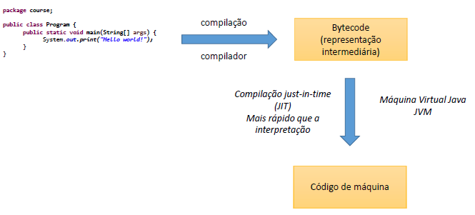
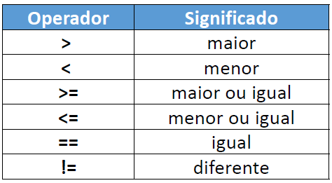
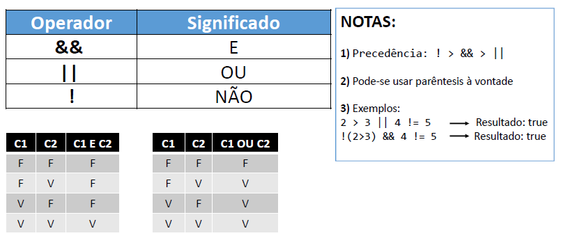
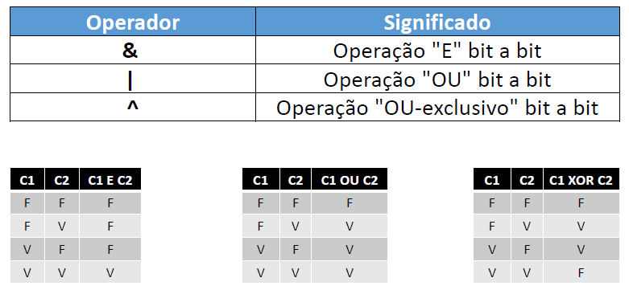
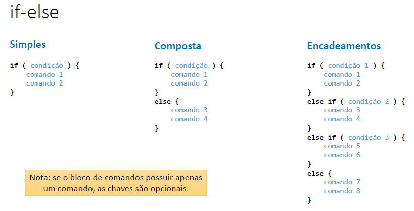
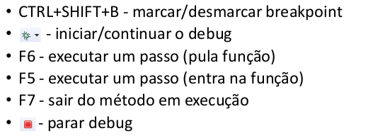
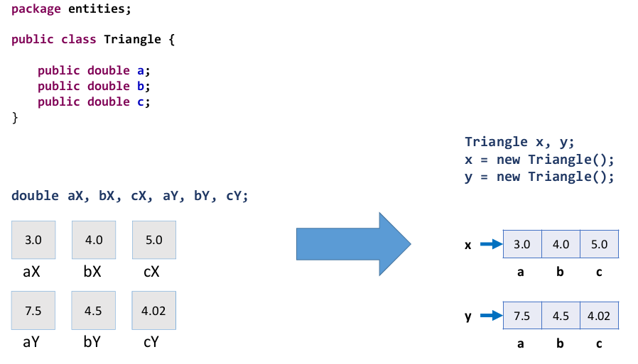
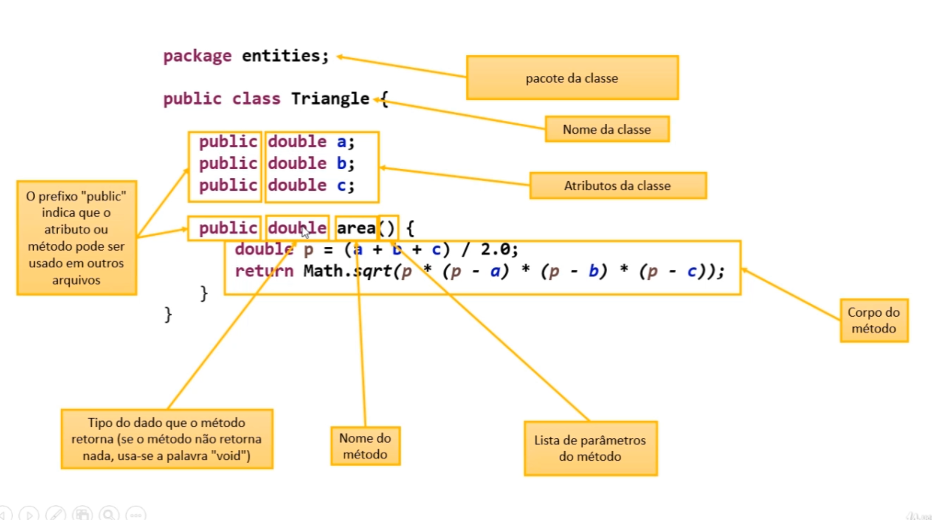

# Java COMPLETO 2018 Programação Orientada a Objetos +Projetos

*Reiniciado 2019*

https://www.udemy.com/java-curso-completo/

Curso mais didático e completo de Java e Orientação a Objetos. Projetos reais com UML, Spring Boot, MongoDB e muito mais 

## <a name="indice">Índice</a>

1. [Introdução](#parte1)     
2. [Apresentação da linguagem Java e tópicos básicos](#parte2)     
3. [Introdução à Programação Orientada a Objetos](#parte3)     
4. [Construtores, palavra this, sobrecarga, encapsulamento](#parte4)     
5. [Comportamento de memória, arrays, listas](#parte5)     
6. [Tópicos especiais em Java](#parte6)     
7. [Bônus - nivelamento sobre Git e Github](#parte7)     
8. [Enumerações, composição](#parte8)     
9. [Herança e polimorfismo](#parte9)     
10. [Tratamento de exceções](#parte10)     
11. [Projeto: Sistema jogo de xadrez](#parte11)     
12. [Trabalhando com arquivos](#parte12)     
13. [Interfaces](#parte13)     
14. [Generics, Set, Map](#parte14)     
15. [Programação funcional e expressões lambda](#parte15)     
16. [Acesso a banco de dados com JDBC](#parte16)     
17. [Interface gráfica com JavaFX](#parte17)     
18. [Projeto: Aplicação desktop com JavaFX e banco de dados MySQL com JDBC](#parte18)     
19. [Projeto: API Restful web com Spring Boot e banco de dados MongoDB](#parte19)     
20. [Seção bônus](#parte20)     
---


## <a name="parte1">1 - Introdução</a>

[PDF Módulo 2](2-Apresentacao-da-linguagem-Java-e-topicos-basicos/pdf/2.1-02-java-topicos-basicos.pdf)

[Voltar ao Índice](#indice)

---


## <a name="parte2">2 - Apresentação da linguagem Java e tópicos básicos</a>

#### 2.4. Contextualização Parte 1 histórico e edições

- Linguagem de programação (regras sintáticas)
- Plataforma de desenvolvimento e execução
  - Bibliotecas (API)
  - Ambientes de execução

**Aspectos notáveis**

- Código compilado para bytecode e executado em máquina virtual (JVM)
- Portável, segura, robusta
- Roda em vários tipos de dispositivos
- Domina o mercado corporativo desde o fim do século 20
- Padrão Android por muitos anos

**Edições**

- Java ME - Java Micro Edition - dispositivos embarcados e móveis - IoT
  - http://www.oracle.com/technetwork/java/javame
- Java SE - Java Standard Edition - core - desktop e servidores
  - http://www.oracle.com/technetwork/java/javase
  - https://en.wikipedia.org/wiki/Java_version_history
- JavaFX - desktop e RIA
- Java EE - Java Enterprise Edition - aplicações corporativas
  - http://www.oracle.com/technetwork/java/javaee
  - https://en.wikipedia.org/wiki/Java_EE_version_history


#### 2.5. Contextualização Parte 2 JRE, JDK, bytecodes e máquina virtual

- Bibliotecas - API specification
  - https://docs.oracle.com/javase/8/docs/api/
  - https://docs.oracle.com/javase/10/docs/api/
- JVM - Java Virtual Machine
  - Máquina virtual do Java - necessário para executar sistemas Java
- http://www.oracle.com/technetwork/java/javase/downloads
  - JRE - Java Runtime Environment
  - Necessário para usuários finais executarem aplicações Java no computador
- Server JRE
  - Necessário para executar sistemas Java em servidores
- JDK - Java Development Kit
  - Necessário para desenvolvedores Java. Contém o JRE, mais ferramentas para desenvolvimento, depuração e monitoramento de projetos Java.

**Compilação e interpretação**

- Linguagens compiladas: C, C++
- Linguagens interpretadas: PHP, JavaScript
- Linguagens pré-compiladas + máquina virtual: Java, C#

**Modelo de execução**



#### 2.6. Estrutura de uma aplicação Java

- Uma aplicação é composta por classes
- package = agrupamento LÓGICO de classes relacionadas
- Módulo (Java 9+) = Agrupamento lógico de pacotes relacionados
  - Runtime = Agrupamento físico
- Aplicação = Agrupamento de módulo relacionados

#### 2.8. Instalação do JDK e Eclipse no Windows

**Checklist**

- Certifique-se de que seu Windows esteja devidamente licenciado e atualizado
  - Windows update

- Baixar e instalar o Java JDK
  - http://www.oracle.com/technetwork/java/javase/downloads

- Configurar variáveis de ambiente do sistema
  - Painel de Controle -> Variáveis de Ambiente
  - Variável JAVA_HOME: C:\Program Files\Java\jdk-10.0.1
  - Variável Path: incluir C:\Program Files\Java\jdk-10.0.1\bin
  - Testar no terminal de comando: java --version

- Baixar e descompactar o Eclipse
  - https://www.eclipse.org/downloads/eclipse-packages/
  - Testar: rodar o Eclipse e escolher um "workspace" (pasta onde você vai salvar seus projetos)

#### 2.9. Primeiro programa em Java no Eclipse

**Checklist**

- Window -> Perspective -> Open Perspective -> Java
- File -> New -> Java Project
- Package Explorer
  - JRE System Library
  - Pasta "src"
- Criar classe
  - Botão direito no projeto -> New -> Class
  - Escolher um nome para a classe (iniciar com letra Maiúscula)
  - Escolher um nome para o pacote (iniciar com letra Minúscula)
  - Selecionar public static void main
- Classe
  - package
  - Cláusula import: referências a outros pacotes
  - Classe
  - Método
  - public static void main(String[] args)
- Executar o programa: Botão direito no arquivo -> Run As -> Java Application
- Como fechar e reabrir o projeto? E o workspace?
- Dica: indentação automática: CTRL + SHIFT -> F

- 2-Apresentacao-da-linguagem-Java-e-topicos-basicos\Course_1\src\course\Program.java

```java
package course;

public class Program {
	public static void main(String[] args) {
		System.out.println("Hello world!");
	}
}

```

#### 2.10. Tipos primitivos em Java

**Checklist**

- https://docs.oracle.com/javase/tutorial/java/nutsandbolts/datatypes.html

- Java é uma linguagem estaticamente tipada
- Tipos primitivos em Java
- Tipos referência String e Object
- Variável não iniciada
- Valores padrão
- Overflow
- Padrão para float: sufixo "f"
- Padrão para char: aspas simples
- Padrão para string: aspas duplas
- Padrão para boolean: true, false
- Opção: inferência de tipos com palavra "var" (dentro de métodos)

**Tipos primitivos em Java (tipo valor)**


**String e Object**


**Valores padrão**

Quando criamos um array ou um objeto com atributos desses tipos, esses são os valores atribuídos inicialmente aos dados.


**Tipo valor vs. tipo referência**


```java
package app;

public class Programm {

	public static void main(String[] args) {

		boolean completed = false;
		char gender = 'F';
		char letter = '\u0041';
		byte n1 = 126;
		int n2 = 1000;
		int n3 = 2147483647;
		long n4 = 2147483648L;
		float n5 = 4.5f;
		double n6 = 4.5;
		
		String name = "Maria Green";
		Object obj1 = "Alex Brown";
		Object obj2 = 4.5f;
		
		System.out.println(completed);
		System.out.println(gender);
		System.out.println(letter);
		System.out.println(n1);
		System.out.println(n2);
		System.out.println(n3);
		System.out.println(n4);
		System.out.println(n5);
		System.out.println(n6);
		System.out.println(name);
		System.out.println(obj1);
		System.out.println(obj2);

	}

}

```

#### 2.11. Restrições e convenções para nomes

- Não pode começar com dígito: use uma letra ou _
- Não usar acentos ou til
- Não pode ter espaço em branco
- Sugestão: use nomes que tenham um significado

**Convenções**

- Camel Case: lastName
  - pacotes
  - atributos
  - métodos
  - variáveis e parâmetros
- Pascal Case: ProductService
  - classes

```java
package entities;
public class Account {
    private String holder;
    private Double balance;
    public Account(String holder, Double balance) {
        this.holder = holder;
        this.balance = balance;
    }
    public String getHolder() {
        return holder;
    }
    public void deposit(double amount) {
        balance += amount;
    }
    public void withdraw(double amount) {
        balance -= amount;
    }
}
```

#### 2.12. Conversão implícita e casting

- Conversão implícita entre tipos
- Casting: conversão explícita entre tipos COMPATÍVEIS

```java
package app;

public class Programm {

	public static void main(String[] args) {
		
		// Exemplo 1
		/*
		double a;
		float b;
		a = 5.0;
		b = (float)a;
		System.out.println(b);
		*/
		
		// Exemplo 2
		/*
		double a;
		int b;
		a = 5.0;
		b = (int)a;
		System.out.println(b);
		 */

		//Exemplo 3
		int a, b;
		double result;
		a = 5;
		b = 2;
		result = (double) a / b;
		System.out.println(result);

	}

}

```

#### 2.13. Saída de dados em Java

```java
package app;

import java.util.Locale;

public class Programm {

	public static void main(String[] args) {
		
		char gender = 'F';
		int age = 32;
		double balance = 10.35784;
		String name = "Maria";
		
		System.out.print("Good morning!");
		System.out.println("Good afternoon!");
		System.out.println("Good night!");
		System.out.println("---------------------------");
		System.out.println(balance);
		System.out.printf("%.2f%n", balance);
		System.out.printf("%.4f%n", balance);
		Locale.setDefault(Locale.US);
		System.out.printf("%.4f%n", balance);
		System.out.println("---------------------------");
		System.out.printf("%s is %d years old, gender %c, and got balance = %.2f bitcoins%n", name, age,gender, balance);
	}
}

```

```
Good morning!Good afternoon!
Good night!
---------------------------
10.35784
10,36
10,3578
10.3578
---------------------------
Maria is 32 years old, gender F, and got balance = 10.36 bitcoins

```

**Exercício de fixação**

Em um novo programa, inicie as seguintes variáveis:
```
String product1 = "Computer";
String product2 = "Office desk";
int age = 30;
int code = 5290;
char gender = 'F';
double price1 = 2100.0;
double price2 = 650.50;
double measure = 53.234567;
```
Em seguida, usando os valores das variáveis, produza a seguinte saída na tela do console:

```
Products:
Computer, which price is $ 2100,00
Office desk, which price is $ 650,50

Record: 30 years old, code 5290 and gender: F

Measue with eight decimal places: 53,23456700
Rouded (three decimal places): 53,235
US decimal point: 53.235
```

```java
package app;

import java.util.Locale;

public class Exercicio {
	public static void main(String[] args) {
		String product1 = "Computer";
		String product2 = "Office desk";
		byte age = 30;
		int code = 5290;
		char gender = 'F';
		double price1 = 2100.0;
		double price2 = 650.50;
		double measure = 53.234567;
		
		System.out.println("Products:");
		System.out.printf("%s, which price is $ %.2f%n", product1, price1);
		System.out.printf("%s, which price is $ %.2f%n", product2, price2);
		System.out.println();
		System.out.printf("Record: %d years old, code %d and gender: %c%n", age, code, gender);
		System.out.println();
		System.out.printf("Measue with eight decimal places: %.8f%n", measure);
		System.out.printf("Rouded (three decimal places): %.3f%n", measure);
		
		Locale.setDefault(Locale.US);
		System.out.printf("US decimal point: %.3f%n", measure);
	}
}
```

```
Products:
Computer, which price is $ 2100,00
Office desk, which price is $ 650,50

Record: 30 years old, code 5290 and gender: F

Measue with eight decimal places: 53,23456700
Rouded (three decimal places): 53,235
US decimal point: 53.235

```

#### 2.14. Operadores aritméticos


```java
package app;

public class Programm {

	public static void main(String[] args) {

		int n1 = 3 + 4 * 2;
		int n2 = (3 + 4) * 2;
		int n3 = 17 % 3;
		double n4 = 10.0 / 8.0;
		
		double a = 1.0, b = -3.0, c = -4.0;
		double x1 = (-b + Math.sqrt(b * b - 4 * a * c)) / (2 * a);

		System.out.println(n1);
		System.out.println(n2);
		System.out.println(n3);
		System.out.println(n4);
		System.out.println(x1);

	}
}
```

```
11
14
2
1.25
4.0
```

#### 2.15. Operadores de atribuição


```java
package app;

public class Programm {

	public static void main(String[] args) {

		double n1 = 10;
		double n2 = 30;
		String s = "ABC";
		System.out.println(n1);
		System.out.println(n2);
		System.out.println(s);
		System.out.println("-------------");
		
		n1 *= 2;
		n2 += n1;
		s += "DEF";
		System.out.println(n1);
		System.out.println(n2);
		System.out.println(s);
	}
}

```

```
10.0
30.0
ABC
-------------
20.0
50.0
ABCDEF

```

**Operadores aritméticos / atribuição Operador**


#### 2.16. Entrada de dados em Java - Parte 1

**Scanner**

Uma das formas de se ler dados em Java é por meio de um objeto do tipo Scanner, o qual deve ser instanciado com o argumento System.in:


Checklist

- Ler um texto até a quebra de linha e armazenar em uma variável
- Ler três palavras, uma em cada linha, armazenando cada uma em uma variável
- Ler três palavras na mesma linha, separadas por espaço, armazenando cada uma em uma variável


```java
package app;

import java.util.Scanner;

public class Program {

	public static void main(String[] args) {
		
		Scanner sc = new Scanner(System.in);
		
		String sentence = sc.nextLine();
		String x,y,z;
		
		x = sc.next();
		y = sc.next();
		z = sc.next();
		
		System.out.println(sentence);
		System.out.println(x);
		System.out.println(y);
		System.out.println(z);
		
		x = sc.next();
		y = sc.next();
		z = sc.next();
		System.out.println(x);
		System.out.println(y);
		System.out.println(z);
		
		sc.close();
	}
}

```

#### 2.17. Entrada de dados em Java - Parte 2

**Checklist**

- Ler um número inteiro
- Ler um texto até a quebra de linha
- Ler um caractere
- Ler um código composto de uma letra e um dígito (exemplo: "a3"). Armazenar os valores um uma variável tipo char e outra tipo int, respectivamente.
- Ler um número double
- Ler um nome (única palavra), sexo (caractere F ou M), idade (inteiro) e altura (double) na mesma linha, armazenando-os em quatro variáveis com os devidos tipos


**Limpeza de stream de entrada (flush)**

Antes de fazer um nextLine()

- Se antes foi dada uma quebra de linha na stream de entrada sem o nextLine()
- Então é preciso fazer um nextLine() extra para "limpar" a quebra de linha que fica pendente na stream

**Operação substring**

```java
String s = "abcdefgh";
String sub1 = s.substring(3);
String sub2 = s.substring(3, 5);
System.out.println(sub1);
System.out.println(sub2);
```

SAÍDA:

```
defgh
de
```

```java
package app;

import java.util.Locale;
import java.util.Scanner;

public class Program {

	public static void main(String[] args) {

		Locale.setDefault(Locale.US);
		Scanner sc = new Scanner(System.in);

		int n1 = sc.nextInt();

		sc.nextLine(); // Limpeza de stream de entrada (flush)

		String name = sc.nextLine();
		char gender = sc.next().charAt(0);

		String s = sc.next();
		char letter = s.charAt(0);
		int digit = Integer.parseInt(s.substring(1));

		double n2 = sc.nextDouble(); // 4.32

		String name2 = sc.next(); // Maria F 23 1.68
		char ch = sc.next().charAt(0);
		int age = sc.nextInt();
		double height = sc.nextDouble();

		System.out.println(n1);
		System.out.println(name);
		System.out.println(gender);
		System.out.println(letter);
		System.out.println(digit);
		System.out.println(n2);
		System.out.println(name2);
		System.out.println(ch);
		System.out.println(age);
		System.out.println(height);
		
		sc.close();

	}

}

```

**Exercício de fixação**


```java
package exercicio;

import java.util.Locale;
import java.util.Scanner;

public class Programm {

	public static void main(String[] args) {

		Locale.setDefault(Locale.US);
		Scanner sc = new Scanner(System.in);
		
		System.out.println("Enter your full name:");
		String fullName = sc.nextLine();
		
		System.out.println("How many bedrooms are there in your house?");
		int bedrooms = sc.nextInt();
		
		System.out.println("Enter product price:");
		double price = sc.nextDouble();
		
		System.out.println("Enter your last name, age and height (same line):");
		String lastName = sc.next();
		int age = sc.nextInt();
		double height = sc.nextDouble();
		
		System.out.println(fullName);
		System.out.println(bedrooms);
		System.out.printf("%.2f%n", price);
		System.out.println(lastName);
		System.out.println(age);
		System.out.printf("%.2f%n", height);
		
		sc.close();

	}

}

```

#### 2.20. Operadores comparativos



```java
package app;

public class Programm {

	public static void main(String[] args) {

		int a = 10;
		boolean c1 = a < 10;
		boolean c2 = a < 20;
		boolean c3 = a > 10;
		boolean c4 = a > 5;
		System.out.println(c1);
		System.out.println(c2);
		System.out.println(c3);
		System.out.println(c4);
		System.out.println("------------");
		
		boolean c5 = a <= 10;
		boolean c6 = a >= 10;
		boolean c7 = a == 10;
		boolean c8 = a != 10;
		System.out.println(c5);
		System.out.println(c6);
		System.out.println(c7);
		System.out.println(c8);
	}
}

```

```
false
true
false
true
------------
true
true
true
false
```

#### 2.21. Operadores lógicos



```java
package app;
public class Programm {
	public static void main(String[] args) {

		boolean c1 = 2 > 3 || 4 != 5;
		boolean c2 = !(2 > 3) && 4 != 5;
		System.out.println(c1);
		System.out.println(c2);
		
		System.out.println();
		
		boolean c3 = 10 < 5;
		boolean c4 = c1 || c2 && c3;
		System.out.println(c4);
	}
}

```

```
true
true

true
```

#### 2.22. Operadores bitwise




```java
package exemplo1;
public class Exemplo1 {
	public static void main(String[] args) {
		int n1 = 89;
		int n2 = 60;
		System.out.println(n1 & n2);
		System.out.println(n1 | n2);
		System.out.println(n1 ^ n2);
		/*
		 * 24 
		 * 125 
		 * 101
		 * 
		 */
	}
}

```

```java
package exemplo2;
import java.util.Scanner;
public class Exemplo2 {
	public static void main(String[] args) {

		Scanner sc = new Scanner(System.in);
		int mask = 0b100000;
		int n = sc.nextInt();
		
		if ((n & mask) != 0) {
			System.out.println("6th bit is true!");
		} else {
			System.out.println("6th bit is false");
		}
		sc.close();
	}
}

```

#### 2.23. Estruturas condicionais




```java
package exemplos;

import java.util.Scanner;

public class Program_1 {

	public static void main(String[] args) {
		
		Scanner sc = new Scanner(System.in);
		System.out.println("Enter an integer numver: ");
		
		int n = sc.nextInt();
		
		if(n % 2 == 0) {
			System.out.println("Even!");
		}else{
			System.out.println("Odd!");
		}
		sc.close();

	}

}

```

```java
package exemplos;

import java.util.Scanner;

public class Program_2 {
	public static void main(String[] args) {
		
		Scanner sc = new Scanner(System.in);
		
		System.out.println("What time is it?");
		int time = sc.nextInt();
		
		if(time < 12) {
			System.out.println("Good morning");
		}else if(time < 18 ) {
			System.out.println("Good afternoon!!");
		}else {
			System.out.println("Good Evening");
		}
		sc.close();
		
	}
}

```

**Exercício de fixação**

Fazer um programa para ler três números inteiros na mesma linha, separados por espaço em branco.
Em seguida, mostrar na tela qual é o maior dos números lidos. Se houver empate, mostrar apenas um.


```java
package exercicio;

import java.util.Locale;
import java.util.Scanner;

public class Exercicio_1 {

	public static void main(String[] args) {

		Locale.setDefault(Locale.US);
		Scanner sc = new Scanner(System.in);
		
		int a = sc.nextInt();
		int b = sc.nextInt();
		int c = sc.nextInt();
		
		if( a > b && a > c) {
			System.out.println("Highter = " + a);
		}else if(b > c) {
			System.out.println("Highter = " + b);
		}else {
			System.out.println("Highter = " + c);
		}
		sc.close();

	}

}

```

#### 2.26. Funções interessantes para String

- Formatar: toLowerCase(), toUpperCase(), trim()  
- Recortar: substring(inicio), substring(inicio, fim)  
- Substituir: Replace(char, char), Replace(string, string)  
- Buscar: IndexOf, LastIndexOf  
- str.Split(" ")  


```java
package exemplos;

public class Program_1 {
	public static void main(String[] args) {
		String original = "abcde FGHIJ ABC abc DEFG ";
		String s01 = original.toLowerCase();
		String s02 = original.toUpperCase();
		String s03 = original.trim();
		String s04 = original.substring(2);
		String s05 = original.substring(2, 9);
		String s06 = original.replace('a', 'x');
		String s07 = original.replace("abc", "xy");
		int i = original.indexOf("bc");
		int j = original.lastIndexOf("bc");
		System.out.println("Original: -" + original + "-");
		System.out.println("toLowerCase: -" + s01 + "-");
		System.out.println("toUpperCase: -" + s02 + "-");
		System.out.println("trim: -" + s03 + "-");
		System.out.println("substring(2): -" + s04 + "-");
		System.out.println("substring(2, 9): -" + s05 + "-");
		System.out.println("replace('a', 'x'): -" + s06 + "-");
		System.out.println("replace('abc', 'xy'): -" + s07 + "-");
		System.out.println("Index of 'bc': " + i);
		System.out.println("Last index of 'bc': " + j);
		
		System.out.println("---------------------");
		
		// Operação split
		String s = "potato apple lemon";
		String[] vect = s.split(" ");
//		String word1 = vect[0];
//		String word2 = vect[1];
//		String word3 = vect[2];
		System.out.println(vect[0]);
		System.out.println(vect[1]);
		System.out.println(vect[2]);
	}
}


```

```
Original: -abcde FGHIJ ABC abc DEFG -
toLowerCase: -abcde fghij abc abc defg -
toUpperCase: -ABCDE FGHIJ ABC ABC DEFG -
trim: -abcde FGHIJ ABC abc DEFG-
substring(2): -cde FGHIJ ABC abc DEFG -
substring(2, 9): -cde FGH-
replace('a', 'x'): -xbcde FGHIJ ABC xbc DEFG -
replace('abc', 'xy'): -xyde FGHIJ ABC xy DEFG -
Index of 'bc': 1
Last index of 'bc': 17
---------------------
potato
apple
lemon

```

#### 2.27. Sintaxe alternativa - switch-case

Estrutura opcional a vários if-else encadeados, quando a condição envolve o teste do valor de uma variável.

```java
package app;

import java.util.Scanner;

public class Program {

	public static void main(String[] args) {

		Scanner sc = new Scanner(System.in);
		int x = sc.nextInt();
		String day;
		switch (x) {
		case 1:
			day = "Sunday";
			break;
		case 2:
			day = "Monday";
			break;
		case 3:
			day = "Tuesday";
			break;
		case 4:
			day = "Wednesday";
			break;
		case 5:
			day = "Thursday";
			break;
		case 6:
			day = "Friday";
			break;
		case 7:
			day = "Saturday";
			break;
		default:
			day = "Invalid value";
		}
		System.out.println("Day: " + day);
		
		sc.close();

	}

}

```

#### 2.28. Expressão condicional ternária

Estrutura opcional ao if-else quando se deseja decidir um VALOR com base em uma condição.

Sintaxe:

( condição ) ? valor_se_verdadeiro : valor_se_falso

```java
package app;

public class Programm {

	public static void main(String[] args) {

		double preco = 34.5;
		//double desconto;
		
//		if (preco < 20.0) {
//			desconto = preco * 0.1;
//		} else {
//			desconto = preco * 0.05;
//		}
		
		double desconto = (preco < 20.0) ? preco * 0.1 : preco * 0.05;
		
		System.out.println(desconto);
	}

}

```


#### 2.29. Escopo e inicialização

- Escopo de uma variável: é a região do programa onde a variável é válida, ou seja, onde ela pode ser referenciada.
- Uma variável não pode ser usada se não for iniciada.

```java
package app;

import java.util.Scanner;

public class Programm {

	public static void main(String[] args) {
		Scanner sc = new Scanner(System.in);
		
		//double price = 400;
		double discount;
		
		double price = sc.nextDouble();
		if (price > 100.0) {
			discount = price * 0.1;
		}else {
			discount = 0;
		}
		System.out.println(discount);
		sc.close();
	}

}

```

#### 2.30. Comentários em Java (básico)

```java
package app;

import java.util.Locale;
import java.util.Scanner;

/*
Este programa calcula as raízes de uma equação do segundo grau
Os valores dos coeficientes devem ser digitados um por linha
*/

public class Programm {

	public static void main(String[] args) {
		
		Locale.setDefault(Locale.US);
		Scanner sc = new Scanner(System.in);
		double a, b, c, delta;
		System.out.println("Digite os valores dos coeficientes:");
		a = sc.nextDouble();
		b = sc.nextDouble();
		c = sc.nextDouble();
		delta = b * b - 4 * a * c; // cálculo do valor de delta
		
		System.out.println(delta);
		
		sc.close();

    }

}

```

#### 2.31. Funções (sintaxe)

• Representam um processamento que possui um significado
    • Math.sqrt(double)
    • System.out.println(string)
• Principais vantagens: modularização, delegação e reaproveitamento
• Dados de entrada e saída
    • Funções podem receber dados de entrada (parâmetros ou argumentos)
    • Funções podem ou não retornar uma saída
• Em orientação a objetos, funções em classes recebem o nome de "métodos"

**Problema exemplo**

Fazer um programa para ler três números inteiros e mostrar na tela o maior deles.

```
Enter three numbers:
5
8
3
Higher = 8
```

```java
package app;

import java.util.Scanner;

public class Program {

	public static void main(String[] args) {
		
		Scanner sc = new Scanner(System.in);
		
		System.out.println("Enter three number");
		int a = sc.nextInt();
		int b = sc.nextInt();
		int c = sc.nextInt();
		
//		if(a > b && a > c) {
//			System.out.println("Higher = " + a);
//		} else if(b > c) {
//			System.out.println("Higher = "+ b );
//		}else {
//			System.out.println("Higher = "+ c);
//		}
		int higher = max(a,b,c);
		showResult(higher);
		
		sc.close();
		
	}
	
	public static int max(int a, int b, int c) {
		int aux;
		if(a > b && a > c) {
			aux = a;
		} else if(b > c) {
			aux = b;
		}else {
			aux = c;
		}
		return aux;
	}
	public static void showResult( int value) {
		System.out.println("Higher = " + value);
	}

}

```

#### 2.32. Debugging com Eclipse

• Teclas



• Perspectiva Debug
	• Aba importante: Variables

#### 2.33. Estrutura repetitiva while

```
while ( condição ) {
	comando 1
	comando 2
}
```

**Problema exemplo**

Digitar um número e mostrar sua raiz quadrada com três casas decimais, depois repetir o procedimento. Quando o usuário digitar um número negativo (podendo inclusive ser na primeira vez), mostrar uma mensagem "Negative number" e terminar o programa.

```
Enter a number: 25
5.000
Enter another number: 10
3.162
Enter another number: 9
3.000
Enter another number: -4
Negative number
```

```java
package app;

import java.util.Locale;
import java.util.Scanner;

public class Program {

	public static void main(String[] args) {
		
		Locale.setDefault(Locale.US);
		Scanner sc = new Scanner(System.in);
		
		System.out.println("ENter a number: ");
		double n = sc.nextDouble();
		
		while(n > 0.0) {
			double sr = Math.sqrt(n);
			System.out.printf("%.3f%n", sr);
			System.out.println("Enter another number");
			n = sc.nextDouble();
		}
		
		System.out.println("NEgative number... end!");
		sc.close();
	}
}

```

#### 2.36. Estrutura repetitiva for

**Estrutura "para"**


**Problema exemplo**

Digitar um número N e depois N valores inteiros. Mostrar a soma dos N valores digitados.

```
How many integer numbers are you going to enter? 3
Value #1: 10
Value #2: 7
Value #3: 8
Sum = 25
```

```java
package app;

import java.util.Scanner;

public class Program {

	public static void main(String[] args) {
		
		Scanner sc = new Scanner(System.in);
		
		System.out.println("How many integer number are you going to enter: ");
		int n = sc.nextInt();
		
		int sum = 0;
		
		for(int i = 1; i<= n ; i++) {
			System.out.print("Value #" + i + ": ");
			int x = sc.nextInt();
			sum += x;
		}
		System.out.println("Sum = "+ sum);
		
		sc.close();

	}

}

```

#### 2.39. Exercício de fixação - estruturas repetitivas while e for

**Exercício de fixação**

Fazer um programa para ler um número N (se for digitado um valor não positivo, mostrar uma mensagem e ler novamente). Em seguida, N valores inteiros. Mostrar o maior dentre os N números digitados. Veja exemplo:

**Exemplo:**

```
Enter N: 0
N must be positive! Try again: -2
N must be positive! Try again: 4
Value #1: 5
Value #2: 4
Value #3: 10
Value #4: 2
Higher = 10
```

**Dica**

```
Integer.MIN_VALUE
Integer.MAX_VALUE
```

```java
package app;

import java.util.Scanner;

public class Program {

	public static void main(String[] args) {
		
		Scanner sc  = new Scanner(System.in);
		
		System.out.print("Enter N: ");
		int n = sc.nextInt();
		while(n <= 0) {
			System.out.println("N nust be positive! try again!: ");
			n = sc.nextInt();
		}
		
		int higher = Integer.MIN_VALUE;
		for(int i = 1 ; i <= n ; i++) {
			System.out.println("Value #"+ i + ": ");
			int x = sc.nextInt();
			if(x > higher) {
				higher = x;
			}
		}

		System.out.println("Higher = "+ higher);
		
		sc.close();

	}

}

```

#### 2.40. Estrutura repetitiva do-while

**Problema exemplo**

Digitar um número e mostrar sua raiz quadrada, depois perguntar ao usuário se ele deseja repetir o procedimento (y/n). Caso ele responda 'y', repetir o procedimento.

```
Enter a number: 9
Square root = 3.000
Repeat (y/n)? y
Enter a number: 10
Square root = 3.162
Repeat (y/n)? n
```

```java
package app;

import java.util.Locale;
import java.util.Scanner;

public class Program {

	public static void main(String[] args) {
		
		Locale.setDefault(Locale.US);
		Scanner sc = new Scanner(System.in);
		
		char resp;
		
		do {
			System.out.print("Enter a number");
			double n = sc.nextDouble();
			double sq = Math.sqrt(n);
			System.out.printf("Square root = %.3f%n", sq);
			
			System.out.print("Repeat? 'y' or 'n'");
			resp = sc.next().charAt(0);
			
		}while(resp != 'n');
		sc.close();
	}

}

```


[Voltar ao Índice](#indice)

---


## <a name="parte3">3 - Introdução à Programação Orientada a Objetos</a>


#### 3.1. Visão geral do capítulo 3

[PDF Módulo 3](3-Introducao-a-Programacao-Orientada-a-Objetos/pdf/2.2-03-classes-atributos-membros-staticos.pdf)

#### 3.3. Resolvendo um problema sem orientação a objetos

**Problema exemplo**

Fazer um programa para ler as medidas dos lados de dois triângulos X e Y (suponha medidas válidas). Em seguida, mostrar o valor das áreas dos dois triângulos e dizer qual dos dois triângulos possui a maior área.
A fórmula para calcular a área de um triângulo a partir das medidas de seus lados a, b e c é a seguinte (fórmula de Heron):


```
Enter the measures of triangle X:
3.00
4.00
5.00
Enter the measures of triangle Y:
7.50
4.50
4.02
Triangle X area: 6.0000
Triangle Y area: 7.5638
Larger area: Y
```

```java
package app;

import java.util.Locale;
import java.util.Scanner;

public class Program {

	public static void main(String[] args) {

		Locale.setDefault(Locale.US);
		Scanner sc = new Scanner(System.in);

		double xA, xB, xC, yA, yB, yC;

		System.out.println("Enter the measures of triangle X:");
		xA = sc.nextDouble();
		xB = sc.nextDouble();
		xC = sc.nextDouble();
		System.out.println("Enter the measures of triangle Y:");
		yA = sc.nextDouble();
		yB = sc.nextDouble();
		yC = sc.nextDouble();

		double p = (xA + xB + xC) / 2.0;
		
		double areaX = Math.sqrt(p * (p - xA) * (p - xB) * (p - xC));
		
		p = (yA + yB + yC) / 2.0;
		
		double areaY = Math.sqrt(p * (p - yA) * (p - yB) * (p - yC));
		
		System.out.printf("Triangle X area: %.4f%n", areaX);
		
		System.out.printf("Triangle Y area: %.4f%n", areaY);
		
		if (areaX > areaY) {
			System.out.println("Larger area: X");
		} else {
			System.out.println("Larger area: Y");
		}
		sc.close();

	}

}

```


#### 3.4. Criando uma classe com três atributos para representar melhor o triângulo


**Classe**

É um tipo estruturado que pode conter (membros):
- Atributos (dados / campos)
- Métodos (funções / operações)

A classe também pode prover muitos outros recursos, tais como:
- Construtores
- Sobrecarga
- Encapsulamento
- Herança
- Polimorfismo

Exemplos:
- Entidades: Produto, Cliente, Triangulo
- Serviços: ProdutoService, ClienteService, EmailService, StorageService
- Controladores: ProdutoController, ClienteController
- Utilitários: Calculadora, Compactador
- Outros (views, repositórios, gerenciadores, etc.)



```java
package entities;

public class Triangle {
	public double a;
	public double b;
	public double c;
}

```

```java
package app;

import java.util.Locale;
import java.util.Scanner;

import entities.Triangle;

public class Program {

	public static void main(String[] args) {

		Locale.setDefault(Locale.US);
		Scanner sc = new Scanner(System.in);

		//double x.a, x.b, x.c, y.a, y.b, y.c;
		
		Triangle x, y;
		x = new Triangle();
		y = new Triangle();
		

		System.out.println("Enter the measures of triangle X:");
		x.a = sc.nextDouble();
		x.b = sc.nextDouble();
		x.c = sc.nextDouble();
		System.out.println("Enter the measures of triangle Y:");
		y.a = sc.nextDouble();
		y.b = sc.nextDouble();
		y.c = sc.nextDouble();

		double p = (x.a + x.b + x.c) / 2.0;
		
		double areaX = Math.sqrt(p * (p - x.a) * (p - x.b) * (p - x.c));
		
		p = (y.a + y.b + y.c) / 2.0;
		
		double areaY = Math.sqrt(p * (p - y.a) * (p - y.b) * (p - y.c));
		
		System.out.printf("Triangle X area: %.4f%n", areaX);
		
		System.out.printf("Triangle Y area: %.4f%n", areaY);
		
		if (areaX > areaY) {
			System.out.println("Larger area: X");
		} else {
			System.out.println("Larger area: Y");
		}
		sc.close();

	}

}

```


#### 3.5. Criando um método para obtermos os benefícios de reaproveitamento e delegação

- 3-Introducao-a-Programacao-Orientada-a-Objetos/3-5-Criando-um-metodo-para-obtermos-os-beneficios-de-reaproveitamento-e-delegacao

```java
package entities;

public class Triangle {
	public double a;
	public double b;
	public double c;

	public double area() {
		double p = (a + b + c) / 2.0;
		return Math.sqrt(p * (p - a) * (p - b) * (p - c));
	}

}

```

```java
package app;

import java.util.Locale;
import java.util.Scanner;

import entities.Triangle;

public class Program {

	public static void main(String[] args) {

		Locale.setDefault(Locale.US);
		Scanner sc = new Scanner(System.in);

		//double x.a, x.b, x.c, y.a, y.b, y.c;
		
		Triangle x, y;
		x = new Triangle();
		y = new Triangle();
		

		System.out.println("Enter the measures of triangle X:");
		x.a = sc.nextDouble();
		x.b = sc.nextDouble();
		x.c = sc.nextDouble();
		System.out.println("Enter the measures of triangle Y:");
		y.a = sc.nextDouble();
		y.b = sc.nextDouble();
		y.c = sc.nextDouble();

		//double p = (x.a + x.b + x.c) / 2.0;
		//double areaX = Math.sqrt(p * (p - x.a) * (p - x.b) * (p - x.c));
		//p = (y.a + y.b + y.c) / 2.0;
		//double areaY = Math.sqrt(p * (p - y.a) * (p - y.b) * (p - y.c));
		double areaX = x.area();
		double areaY = y.area();
		
		System.out.printf("Triangle X area: %.4f%n", areaX);
		
		System.out.printf("Triangle Y area: %.4f%n", areaY);
		
		if (areaX > areaY) {
			System.out.println("Larger area: X");
		} else {
			System.out.println("Larger area: Y");
		}
		sc.close();

	}

}

```



**Projeto da classe (UML)**


**Discussão**

Quais são os benefícios de se calcular a área de um triângulo por meio de um MÉTODO dentro da CLASSE Triangle?

- 1) Reaproveitamento de código: nós eliminamos o código repetido (cálculo das áreas dos triângulos x e y) no programa principal.
- 2) Delegação de responsabilidades: quem deve ser responsável por saber como calcular a área de um triângulo é o próprio triângulo. A lógica do cálculo da área não deve estar em outro lugar.

#### 3.6. Começando a resolver um segundo problema exemplo

**Outro exemplo**
Fazer um programa para ler os dados de um produto em estoque (nome, preço e quantidade no estoque). Em seguida:
• Mostrar os dados do produto (nome, preço, quantidade no estoque, valor total no estoque)
• Realizar uma entrada no estoque e mostrar novamente os dados do produto
• Realizar uma saída no estoque e mostrar novamente os dados do produto

Para resolver este problema, você deve criar uma CLASSE conforme projeto ao lado:


**Example:**

```
Enter product data:
Name: TV
Price: 900.00
Quantity in stock: 10
Product data: TV, $ 900.00, 10 units, Total: $ 9000.00
Enter the number of products to be added in stock: 5
Updated data: TV, $ 900.00, 15 units, Total: $ 13500.00
Enter the number of products to be removed from stock: 3
Updated data: TV, $ 900.00, 12 units, Total: $ 10800.00

```

- /3-6-Comecando-a-resolver-um-segundo-problema-exemplo/src/entities/Product.java
```java
package entities;

public class Product {
	public String name;
	public double price;
	public int quantity;
	
	public double totalValueInStock() {
		return price * this.quantity;
	}
	public void addProducts(int quantity) {
		this.quantity += quantity;
	}
	public void removeProducts(int quantity) {
		this.quantity -= quantity;
	}
}

```
- /3-6-Comecando-a-resolver-um-segundo-problema-exemplo/src/app/Program.java
- 
```java
package app;

import java.util.Locale;
import java.util.Scanner;

import entities.Product;

public class Program {

	public static void main(String[] args) {

		Locale.setDefault(Locale.US);
		Scanner sc = new Scanner(System.in);
		
		Product product = new Product();
		System.out.println("Enter product data:");
		
		System.out.print("Name: ");
		product.name = sc.nextLine();
		
		System.out.print("Price: ");
		product.price = sc.nextDouble();
		
		System.out.print("Quantity in Stock: ");
		product.quantity = sc.nextInt();
		
		System.out.println(product.name + " " + product.price + " "+ product.quantity);
		
		sc.close();
	}

}

```


#### 3.7. Object e toString

- Toda classe em Java é uma subclasse da classe Object
- Object possui os seguintes métodos:
  - getClass- retorna o tipo do objeto
  - equals - compara se o objeto é igual a outro
  - hashCode - retorna um código hash do objeto
  - toString - converte o objeto para string

```java
package entities;

public class Product {
	public String name;
	public double price;
	public int quantity;

	public double totalValueInStock() {
		return price * this.quantity;
	}

	public void addProducts(int quantity) {
		this.quantity += quantity;
	}

	public void removeProducts(int quantity) {
		this.quantity -= quantity;
	}

	public String toString() {
		return name + ", $ " 
					+ String.format("%.2f", price) + ", " 
					+ quantity + " units, Total: $ "
					+ String.format("%.2f", totalValueInStock());
	}
}

```


#### 3.8. Finalizando o programa


```java
```

#### 3.9. Exercícios de fixação

#### 3.10. Membros estáticos - Parte 1

#### 3.11. Membros estáticos - Parte 2

#### 3.12. Exercício de fixação


[Voltar ao Índice](#indice)

---


## <a name="parte4">4 - Construtores, palavra this, sobrecarga, encapsulamento</a>


[Voltar ao Índice](#indice)

---


## <a name="parte5">5 - Comportamento de memória, arrays, listas</a>


[Voltar ao Índice](#indice)

---


## <a name="parte6">6 - Tópicos especiais em Java</a>


[Voltar ao Índice](#indice)

---


## <a name="parte7">7 - Bônus - nivelamento sobre Git e Github</a>


[Voltar ao Índice](#indice)

---


## <a name="parte8">8 - Enumerações, composição</a>


[Voltar ao Índice](#indice)

---


## <a name="parte9">9 - Herança e polimorfismo</a>


[Voltar ao Índice](#indice)

---


## <a name="parte10">10 - Tratamento de exceções</a>


[Voltar ao Índice](#indice)

---


## <a name="parte11">11 - Projeto: Sistema jogo de xadrez</a>


[Voltar ao Índice](#indice)

---


## <a name="parte12">12 - Trabalhando com arquivos</a>


[Voltar ao Índice](#indice)

---


## <a name="parte13">13 - Interfaces</a>


[Voltar ao Índice](#indice)

---


## <a name="parte14">14 - Generics, Set, Map</a>


[Voltar ao Índice](#indice)

---


## <a name="parte15">15 - Programação funcional e expressões lambda</a>


[Voltar ao Índice](#indice)

---


## <a name="parte16">16 - Acesso a banco de dados com JDBC</a>


[Voltar ao Índice](#indice)

---


## <a name="parte17">17 - Interface gráfica com JavaFX</a>


[Voltar ao Índice](#indice)

---


## <a name="parte18">18 - Projeto: Aplicação desktop com JavaFX e banco de dados MySQL com JDBC</a>


[Voltar ao Índice](#indice)

---


## <a name="parte19">19 - Projeto: API Restful web com Spring Boot e banco de dados MongoDB</a>


[Voltar ao Índice](#indice)

---


## <a name="parte20">20 - Seção bônus</a>


[Voltar ao Índice](#indice)

---

